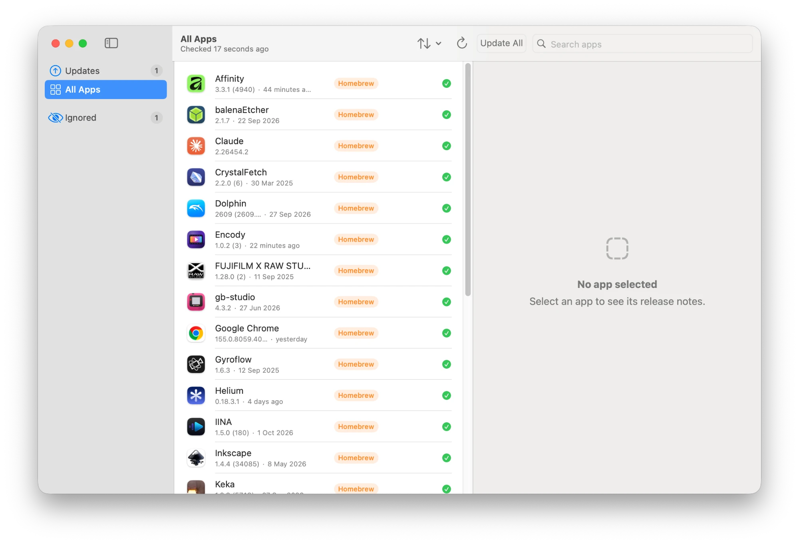
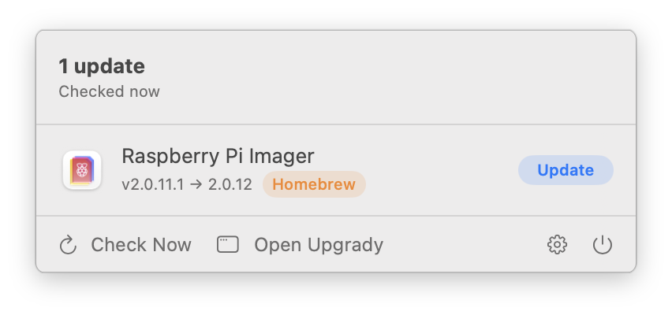

# Upgrady ⬆️


<p align="center"></p>

**Upgrady** keeps every app on your Mac up to date from the menu bar: apps that update themselves with Sparkle, Homebrew casks and Mac App Store apps, all in one place.



## ✨ Features

### Menu bar first
- **Menu bar panel** with the apps to update, their versions and source, and one-click updates with a progress bar, one app at a time or all together.
- **Main window** with Updates, All Apps and Ignored, search, and sorting by name or date.
- **Release notes** for each update, including every release you are skipping.
- **Opens at login** quietly, checks in the background on a schedule and **notifies** you about new updates.
- **Refreshes by itself** when apps are installed, updated or removed.
- Prefer a normal app? The menu bar icon can be turned off.

<p align="center"></p>

### Updates for every kind of app
- **Sparkle apps** are updated inside Upgrady, using each app's own feed and signing keys.
- **Homebrew casks** are updated with `brew upgrade --cask`, with download progress; every check starts with `brew update`.
- **Third-party taps** are read too, including personal taps.
- **Mac App Store apps**, including iPhone and iPad apps, are checked; *Update* opens the App Store. They can also be hidden.
- Each app shows what Upgrady can do for it: install the update itself, hand it to the App Store, or let you know when the app updates itself.

### Homebrew integration
- **Link apps installed by hand** to Homebrew (`brew install --cask --adopt`), or reinstall them from Homebrew.
- Casks from untrusted taps are trusted one by one, only after asking.
- Administrator passwords are asked through a system dialog.

### You decide
- **Ignore** apps or **skip** a version.
- Every feature can be turned off in Settings.
- **Italian 🇮🇹 and English 🇬🇧**, with System, Light and Dark appearance.

## 🚀 Requirements
- macOS 14 (Sonoma) or later.
- [Homebrew](https://brew.sh) for the Homebrew features (optional).

---

## 🍺 Installation via Homebrew (Recommended)

```bash
brew install --cask gionnio/tap/upgrady
```

Upgrady is part of [Gionnio's Homebrew tap](https://github.com/Gionnio/homebrew-tap), together with my other apps.

### 🔄 Updating

```bash
brew upgrade --cask upgrady
```

---

## 📥 Manual Installation (Pre-built App)

1. Go to the **[Releases](../../releases)** section of this page.
2. Download the latest `.zip` file (e.g., `Upgrady_v2.0.0.zip`).
3. Unzip the file and move `Upgrady.app` to your **Applications** folder.

### ⚠️ Important: How to open the app

Since this is an open-source project and not signed with a paid Apple Developer ID, macOS might block the first launch with a security warning ("App cannot be opened because the developer cannot be verified").

**To open it:**

1. Open `Upgrady` once and close the warning.
2. Go to **System Settings → Privacy & Security**, scroll down and click **Open Anyway** next to the Upgrady message.
3. Confirm with **Open**.

*Right-click → Open no longer works on macOS 15 (Sequoia) and later. You only need to do this once.*

### 🔐 Permissions

To update apps with Homebrew or Sparkle, macOS asks you to allow Upgrady under **System Settings → Privacy & Security → App Management**. Upgrady tells you when this is needed and opens the right page.

## 🛠 Build from Source

```bash
git clone https://github.com/Gionnio/upgrady.git
cd upgrady
./build_app.sh --install
```

The script downloads Sparkle (pinned version, verified checksum), builds a universal app, signs it locally and installs it. Run the tests with `swift test`.

## 🚧 Roadmap & TODO

* [x] **Menu bar app** with background checks and notifications.
* [x] **Sparkle, Homebrew and App Store** updates in one place.
* [x] **Homebrew Support:** Install and update via `brew install --cask gionnio/tap/upgrady`.
* [ ] **More release notes** for apps that publish them only on their website.
* [ ] **Update history** of what Upgrady installed.

## Privacy & Security

Upgrady runs locally on your Mac. To check for updates it contacts the update feeds of your apps, the Homebrew API, Apple's App Store lookup API and GitHub (for release notes). No account, no analytics, no personal data.

## 📜 License

Upgrady is released under the [MIT License](LICENSE). It uses [Sparkle](https://sparkle-project.org) (MIT License).

## 🤖 AI Acknowledgment

This application was developed with the assistance of Artificial Intelligence for code generation, logic optimization, and problem-solving.

---

Created with AI, ❤️ and SwiftUI.
